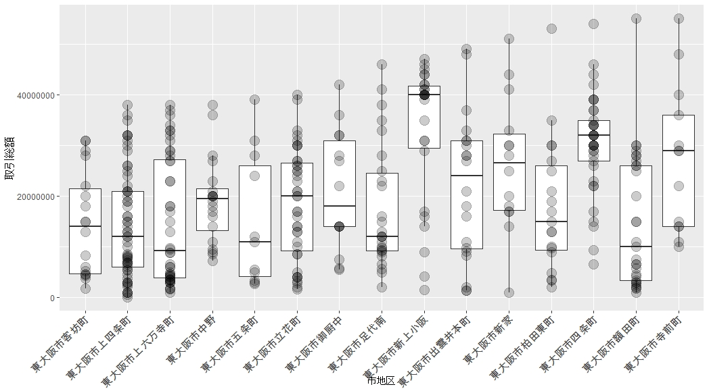

# chiku_sogaku.R
地域毎、駅毎に取引総額でシンプル分析　（取引価格情報を利用）

## データの入手方法等
国交省Hpの取引価格情報をダウンロード。
全国・都道府県毎でも分析可能ですが、市区町村単位(複数も可能)で行うのが無難。

## 利用例
プログラム後半の大阪府東大阪市の例に、独自見解を。
地区ごとの取引総額(10年余のサンプル10未満は除外)でみると、東大阪市の東部、生駒山麓の住宅地の取引総額が低いことが確認できる。
　（東部の山麓は、15地区のうち、客坊町、上四条町、上六万寺町、五条町、立花町、出雲井本町、四条町、額田町の８地区。）
本件では、市街化調整区域の山林・農地は除外されており、宅地が前提となる。山麓部では地価単価が低いことと、もともと棚田のような狭い土地が多くいことの相乗効果？もあって、取引総額が抑えられる傾向が強いものと推測される。

